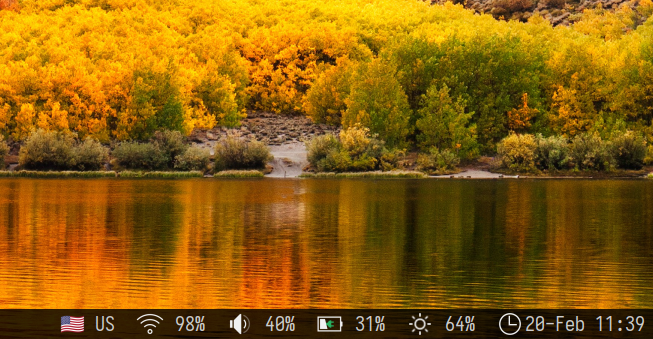

# awesome-wm-widgets

This repo contains Lua scripts of four widgets that I use in Awesome WM. Keyboard layout and time widgets are standard ones with slight modifications.

## Screenshots

### Dark theme

### Light theme

## Setup

